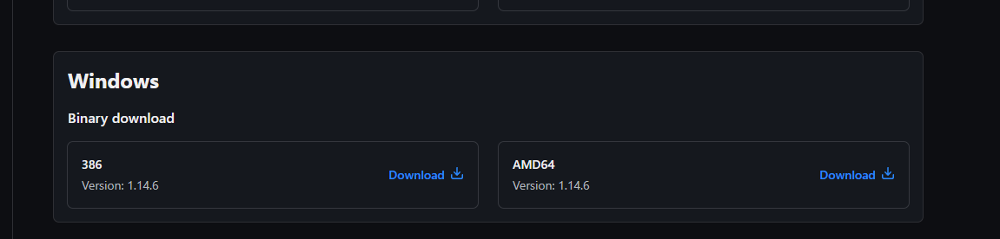
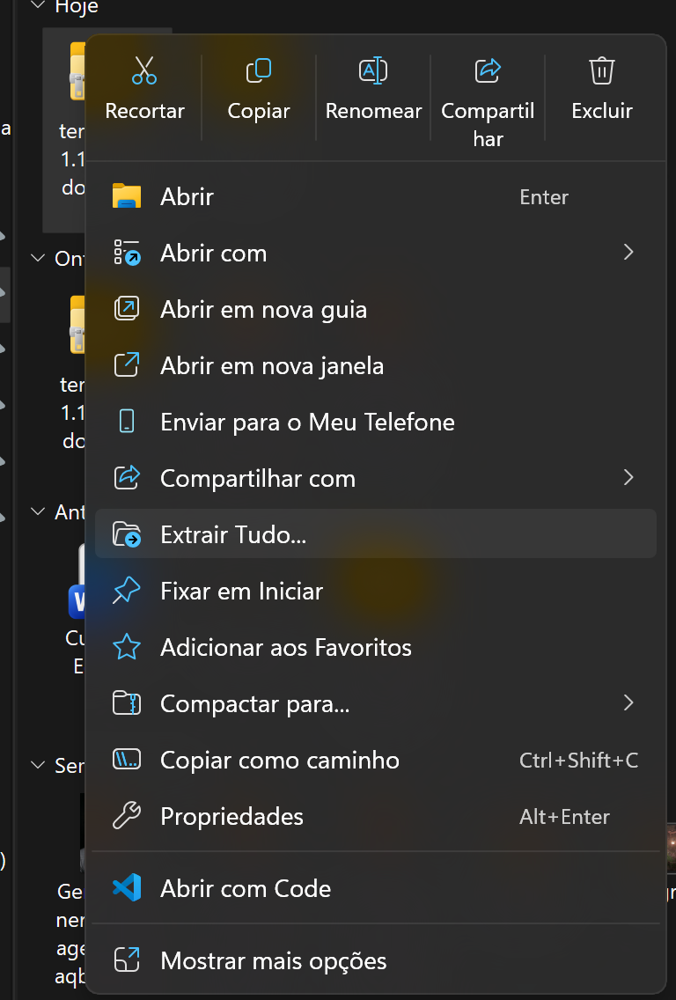
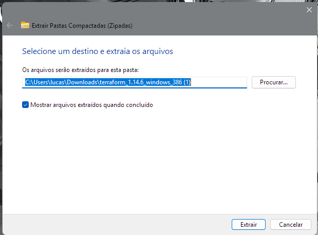
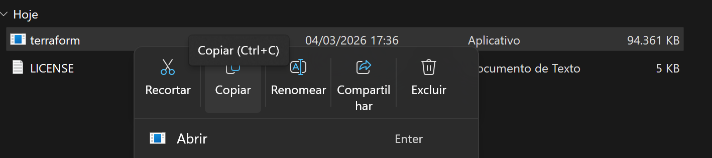
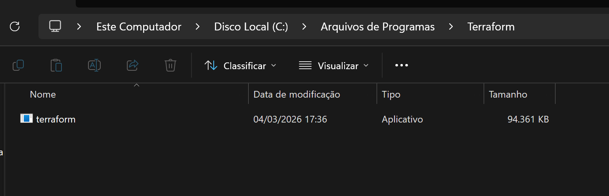
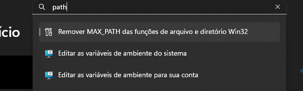
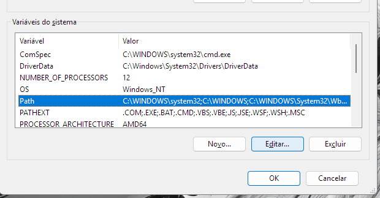
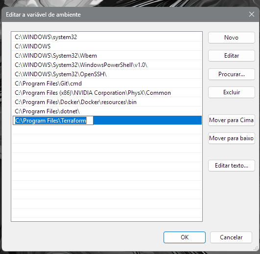
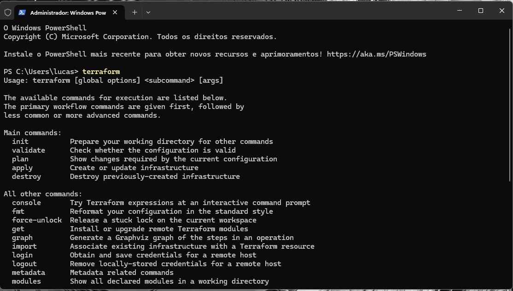
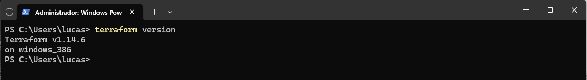

# Estudos de Terraform 🚀

Repositório destinado à documentação e práticas de aprendizado sobre Terraform, focado em Infraestrutura como Código (IaC).

## 📖 O que é?
O Terraform é uma ferramenta para construir, alterar e criar versões de infraestrutura através de código.

## 🛠️ Principais Características

### Infraestrutura como Código (IaC)
* **Infraestrutura Declarativa:** Você define o estado desejado ("o que" construir) e o Terraform entende os passos necessários, sem necessidade de programar comandos manualmente.
* **Versionamento:** Permite a evolução da infraestrutura e automação.
* **Idempotente:** Ao criar um recurso, ele entende quando deve criar ou alterar, evitando a duplicidade de itens.
* **Paridade de Ambiente:** Garante consistência entre diferentes estágios (dev, prod, etc.).

### Linguagem e Sintaxe (HCL)
O Terraform utiliza a **HCL (HashiCorp Configuration Language)**, uma linguagem de alto nível projetada para ser legível por humanos:
* **Declarativa:** Foco no estado final e não nos passos individuais.
* **Blocos de Código:** Estrutura baseada em blocos para definir tipos de recursos e configurações.

### Planos de Execução
* Proporciona **segurança de previsibilidade**.
* Oferece a **separação entre planejamento e aplicação** das mudanças.

### Híbrido e Agnóstico
* Compatível com múltiplos provedores: **AWS, Azure, Oracle, Google Cloud**.
* Permite realizar o deploy para diversos provedores simultaneamente.

---

## ⚙️ Como o Terraform funciona?
O Core do Terraform utiliza duas fontes de entrada principais:
1. **Arquivos de Configuração:** Scripts com o estado desejado.
2. **Estado Atual:** Gerenciado pelo próprio Terraform para saber o que já existe.

### Providers (Provedores)
Os provedores expõem recursos em diferentes níveis:
* **IaaS:** AWS, GCP, Azure.
* **PaaS:** Kubernetes, Heroku, Digital Ocean.
* **SaaS:** New Relic, Datadog.

---

## 💻 Guia de Instalação (Windows)

1. **Download:** Baixe o arquivo compatível no [site oficial](https://developer.hashicorp.com/terraform/install#windows).

2. **Extração:** Extraia o conteúdo do arquivo `.zip` baixado.

Extrair para pasta selecionada. 

3. **Copiando arquivo .exe:** *Copie o arquivo terraform.exe

4. **Configuração da Pasta:** * Crie a pasta `C:\Program Files\Terraform`.
   * Cole o arquivo `terraform.exe` dentro dela.

5. **Variáveis de Ambiente (PATH):**
   * Busque por "Editar as variáveis de ambiente do sistema" no Windows.

   * Em "Variáveis do Sistema", selecione **Path**, clique em **Editar** e depois em **Novo**.

   * Adicione o caminho `C:\Program Files\Terraform` e confirme.

6. **Verificação no Terminal:**

   * `terraform`: Para visualizar comandos disponíveis.

   * `terraform version`: Para confirmar a versão instalada.

---
> 🚧 **Status:** Documentação teórica e ambiente concluídos. Pronto para os primeiros scripts!